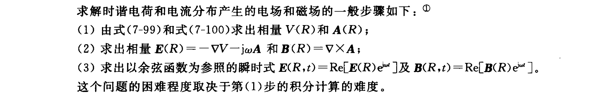

# Chapter 7

## 一、麦克斯韦方程组

微分形式：
$$
\nabla\times\boldsymbol{E}=-\frac{\partial \boldsymbol{B}}{\partial t}\tag{7-1}
$$

$$
\nabla\times\boldsymbol{H}=\boldsymbol{J}+\frac{\partial \boldsymbol{D}}{\partial t}\tag{7-2}
$$

$$
\nabla \cdot\boldsymbol{D}=\rho\tag{7-3}
$$

$$
\nabla\cdot\boldsymbol{B}=0\tag{7-4}
$$

积分形式：
$$
\oint_C \boldsymbol{E}\cdot d\boldsymbol{l}=-\frac{\partial  \Phi}{\partial t}
$$

$$
\oint_C \boldsymbol{H}\cdot d\boldsymbol{l}=\boldsymbol{I}+\int_S\frac{\partial \boldsymbol{D}}{\partial t}\cdot d\boldsymbol{s}
$$

$$
\oint_S \boldsymbol{D}\cdot d\boldsymbol{s}=\boldsymbol{Q}
$$

$$
\oint_S \boldsymbol{B}\cdot d\boldsymbol{s}=0
$$

## 二、位函数

矢量磁位$\boldsymbol{A}$的定义为
$$
\boldsymbol{B}=\nabla\times \boldsymbol{A}
$$
将其代入7-4可得
$$
\nabla\times\boldsymbol{E}=-\frac{\partial }{\partial t}(\nabla\times \boldsymbol{A})
$$

$$
\nabla\times(\boldsymbol{E}+\frac{\partial \boldsymbol{A}}{\partial t})=0
$$

其旋度为0，可以写成一个标量的梯度，可参照电位$V$的定义，得
$$
\boldsymbol{E}=-\nabla V-\frac{\partial \boldsymbol{A}}{\partial t}
$$
矢量磁位$\boldsymbol{A}$的非齐次波动方程
$$
\nabla^2\boldsymbol{A}-\mu \epsilon \frac{\partial^2\boldsymbol{A}}{\partial t^2} =-\mu\boldsymbol{J}
$$
标量电位$V$的非齐次波段方程
$$
\nabla^2V-\mu \epsilon \frac{\partial^2V}{\partial t^2} =-\frac{\rho}{\epsilon}
$$
A和V之间的关系称为洛伦兹规范
$$
\nabla\cdot\boldsymbol{A}+\mu \epsilon \frac{\partial V}{\partial t} =0
$$

## 三、电磁边界条件

一般情况下边界条件和静磁场中的相同
### 1. 两种无损耗线性媒质之间的分界面

在两种无损耗媒质之间的分界面上，通常不会存在自由电荷和面电流，所以它们$\boldsymbol{E}$、$\boldsymbol{H}$的切向分量相等，$\boldsymbol{D}$、$\boldsymbol{B}$的法向分量相等

### 2. 电介质和理想导体之间的分界面

假设媒质1为电介质，媒质2为理想导体，根据理想导体的性质其内部的$\boldsymbol{E}$和$\boldsymbol{D}$为0，时变条件下的麦克斯韦方程组保证了$\boldsymbol{B}$和$\boldsymbol{H}$也为0，根据这个特性对其运用边界条件即可

## 四、位函数波动方程的解

用球坐标进行求解
$$
\frac{1}{R^{2}} \frac{\partial}{\partial R}\left(R^{2} \frac{\partial V}{\partial R}\right)-\mu \epsilon \frac{\partial^{2} V}{\partial t^{2}}=0
$$
引入一个新的变量
$$
V(R,t)=\frac{1}{R}U(R,t)
$$
可得

$$
\frac{\partial U^2}{\partial R^2}-\mu\epsilon \frac{\partial^2 U}{\partial t^2}=0  
$$

解得

$$
U(R,t)=f(t-R\sqrt{\mu\epsilon } )
$$

$$
u=\frac{\bigtriangleup R}{\bigtriangleup t}=\frac{1}{\sqrt{\mu\epsilon }}
$$

$$
V(R,t)=\frac{1}{R}f(t-R/u)
$$

由分布于体积$V'$内的电荷所产生的标量电位为
$$
V(R,t)=\frac{1}{4\pi \epsilon }\int _{V'}\frac{\rho (t-R/u)}{R}dv'
$$
同理
$$
\boldsymbol{A}(R,t)=\frac{u}{4\pi  }\int _{V'}\frac{\boldsymbol{J}(t-R/u)}{R}dv'\ \ \ \ (\text{Wb/m})
$$

## 五、无源波动方程

在波的传播过程中，关注在$\boldsymbol{J}$和$\rho$两者均为零的无源区域中的电磁波特性，得到齐次矢量波动方程

$$
\nabla^2\boldsymbol{E}-\frac{1}{u^2}\frac{\partial^2 \boldsymbol{E}}{\partial t^2} =0
$$

$$
\nabla^2\boldsymbol{H}-\frac{1}{u^2}\frac{\partial^2 \boldsymbol{H}}{\partial t^2} =0
$$

## 六、时谐电磁学

将既随空间坐标变化同时又是时间的正弦函数的场矢量用矢量向量来表示，该矢量向量只依赖于空间坐标，而与时间无关
例子：将$cos\omega t$为参考的时谐场$\boldsymbol{E}$写为
$$
\boldsymbol{E}(x,y,z,t)=Re[\boldsymbol{E}(x,y,z)e^{j\omega t}]
$$
其中$\boldsymbol{E}(x,y,z)$为矢量向量

$\frac{\partial \boldsymbol{E}(x,y,z,t)}{\partial t}$和$\int \boldsymbol{E}(x,y,z,t)dt$分别用矢量向量$j\omega\boldsymbol{E}(x,y,z,t)$和$\boldsymbol{E}(x,y,z,t)/j\omega$表示
$$
\nabla\times\boldsymbol{E}=-j\omega\mu\boldsymbol{H}
$$

$$
\nabla\times \boldsymbol{H}=\boldsymbol{J}+j\omega\epsilon\boldsymbol{E}
$$

$$
\nabla\cdot\boldsymbol{E}=\frac{\rho}{\epsilon}
$$

$$
\nabla\cdot\boldsymbol{H}=0
$$

将标量电位$V$和矢量磁位$\boldsymbol{A}$的波动方程化为时谐波形式

$$
\nabla^2V+k^2V=-\frac{\rho }{\epsilon } 
$$

$$
\nabla^2\boldsymbol{A}+k^2\boldsymbol{A}=-\mu \boldsymbol{J}
$$

$$
k=\omega\sqrt{\mu \epsilon}=\frac{\omega}{\mu}
$$

这两式称为非齐次亥姆霍兹方程
$$
V(R)=\frac{1}{4\pi \epsilon }\int _{V'}\frac{\rho e^{-jkR}}{R}dv'
$$

$$
\boldsymbol{A}(R)=\frac{u}{4\pi  }\int _{V'}\frac{\boldsymbol{J}e^{-jkR}}{R}dv'\ \ \ \ (\text{Wb/m})
$$

{: width=1000px height=500px }

简单媒质中的无源场

$$
\nabla^2\boldsymbol{E}+k^2\boldsymbol{E}=0
$$

$$
\nabla^2\boldsymbol{H}+k^2\boldsymbol{H}=0
$$

上述两式称为齐次矢量亥姆霍兹方程组
