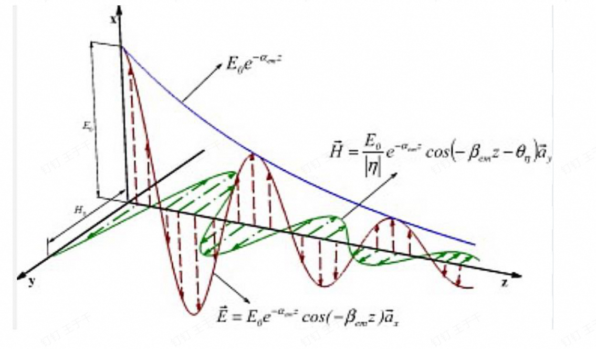
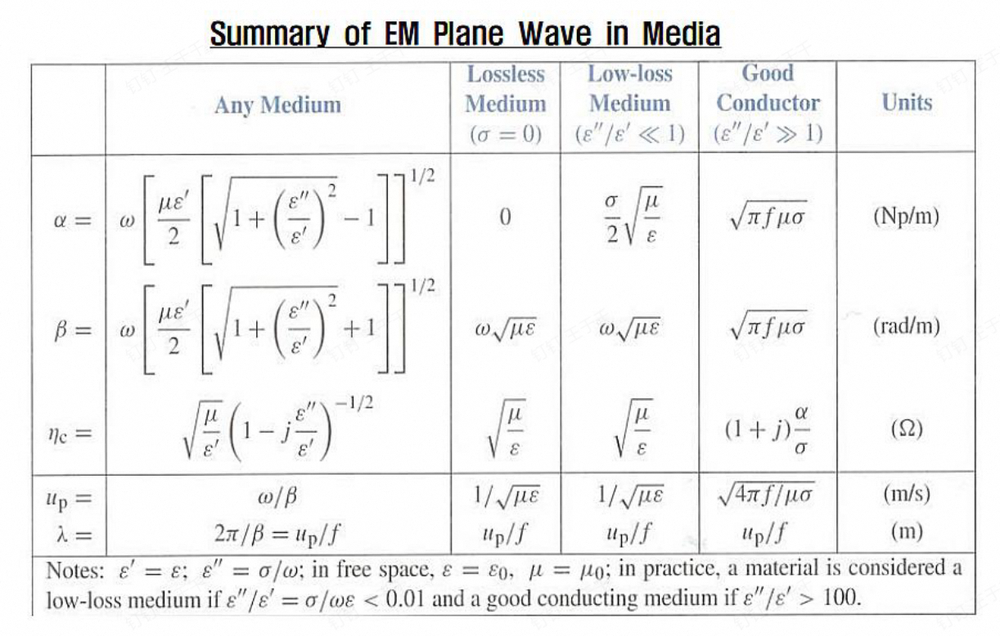

# Chapter 8

## 一、无损耗介质

由亥姆霍兹方程可得
$$
\nabla^2\vec E+k_0^2\vec E=0
$$

$$
k=\omega\sqrt{\mu\epsilon}
$$

考虑$E_x$分量上的亥姆霍兹方程，且在垂直于$z$的平面上$E_x$是均匀的
上述方程可化为

$$
\frac{d^2E_x}{dz^2}+k_0^2E_x=0
$$

解得

$$
E_x(z)=E_0^+(z)e^{-jkz}+E_0^-(z)e^{jkz}
$$

只考虑一个方向波的传播

$$
E_x(z)=E_0^+(z)e^{-jkz}
$$

$$
E_x(z,t)=Re[E_0^+(z)e^{-jkz}e^{j\omega t}]
$$

其中$k$为空间频率，$\omega$为时间频率

可得相速度
$$
u_p=\frac \omega k=\frac 1{\sqrt{\mu\epsilon}}
$$
波长
$$
\lambda=\frac{2\pi}k
$$
再根据电场的旋度的公式可得

$$
H_y^+(z)=\frac1{\eta}E_x^+(z)
$$

阻抗
$$
\eta=\frac \mu \epsilon
$$

## 二、损耗介质

由亥姆霍兹方程可得
$$
\nabla^2\vec E+k_0^2\vec E=0
$$

$$
k=\omega\sqrt{\mu\epsilon_c}
$$

$$
\epsilon_c=\epsilon'+j\epsilon''=\epsilon'-j\frac \sigma  \omega
$$

令$k=\beta-j\alpha，\gamma=jk=\alpha+j\beta$，只考虑$z$轴正方向传播的波，解方程即得

$$
E_x=E_0^+e^{-jkz}=E_0^+e^{-\alpha z}e^{-j\beta z}
$$

### 1. 低损耗介质

低损耗状态下，$\epsilon'>>\epsilon''$，采用二项式展开近似

$$
\gamma=j\omega\sqrt{\mu(\epsilon'+j\epsilon'')}=j\omega\sqrt{\mu\epsilon'}(1+j\frac{\epsilon''}{\epsilon''})^{\frac12}=j\omega\sqrt{\mu\epsilon'}[1-j\frac{\epsilon''}{2\epsilon'}+\frac18(\frac{\epsilon''}{\epsilon'})^2]
$$

$$
\alpha \cong \frac{\omega \epsilon^{\prime \prime}}{2} \sqrt{\frac{\mu}{\epsilon^{\prime}}}
$$

$$
\beta \cong \omega \sqrt{\mu \epsilon^{\prime}}\left[1+\frac{1}{8}\left(\frac{\epsilon^{\prime \prime}}{\epsilon^{\prime}}\right)^{2}\right]
$$

$$
\begin{aligned} \eta_{c} & =\sqrt{\frac{\mu}{\epsilon^{\prime}}}\left(1-j \frac{\epsilon^{\prime \prime}}{\epsilon^{\prime}}\right)^{-1 / 2}\cong \sqrt{\frac{\mu}{\epsilon^{\prime}}}\left(1+j \frac{\epsilon^{\prime \prime}}{2 \epsilon^{\prime}}\right)\end{aligned}
$$

### 2. 良导体

即$\epsilon'<<\epsilon''$
$$
\gamma=j\omega\sqrt{\mu\epsilon_c}=j\omega\sqrt{\mu(\epsilon'-j\frac \sigma\omega)}\approx j\omega\sqrt{-\mu j\frac \sigma\omega}=j\omega\sqrt{\mu \frac \sigma\omega}\frac{1-j}{\sqrt2}=j\sqrt{\mu\omega\sigma}\frac{1-j}{\sqrt2}
$$
又$\omega=2\pi f$，
$$
\gamma=\sqrt{\pi f\mu \sigma}(j+1)
$$
$$
\alpha=\beta=\sqrt{\pi f \mu \sigma}
$$
$$
\eta_{c}=\sqrt{\frac{\mu}{\epsilon_{c}}} \cong \sqrt{\frac{j \omega \mu}{\sigma}}=(1+j) \sqrt{\frac{\pi f \mu}{\sigma}}
$$

所以$H$比$E$落后$45^\circ$的相位

