# Chapter 12

## 一、眼睛

### 1. 眼睛的调节

- 远点距 r ——远点到眼睛物方主点的距离
- 近点距 p ——近点到眼睛物方主点的距离

定义
$$
R=\frac 1r
$$

$$
P=\frac 1p
$$

调节范围，单位为屈光度
$$
A=R-P
$$
眼睛的明视距离为250mm

### 2. 分辨本领

极限分辨角——最靠近二点对人眼（物方节点）的张角φ
对于理想光学系统，其中D为入瞳直径
$$
\phi=\frac {1.22\lambda}{D}
$$

## 二、放大镜

### 1. 视觉放大率

定义：物经放大镜所成像对人眼张角的正切和人眼直接看物体时物对人眼张角的正切之比
$$
M=\frac {tgW'}{tgW}
$$
正常眼，物在物方焦面上，成像于无穷远，则 M 仅被$f'$所决定
$$
M=\frac {250}{f'}
$$
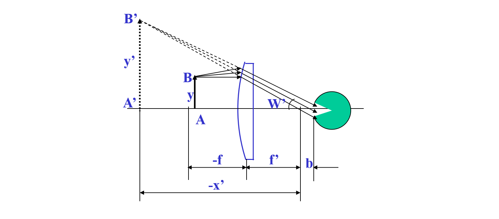

### 2. 放大镜的光束限制

瞳孔——孔阑，出瞳；放大镜——渐晕光阑；无视场光阑

- 无渐晕，$tgW_1'=\frac{h-a'}d$
- 半渐晕，$tgW_2'=\frac{h}d$
- 全渐晕，$tgW_3'=\frac{h+a'}d$

若以 50% 时的线视场为 2y，即 $AB_2$=y，有
$$
2y=2f'tgW_2'=2f'\frac hd=\frac {500h}{Md}
$$
结论：

- 放大镜直径大，则视场大
- 人眼离放大镜近，则视场大
- 放大镜倍率小，则视场大
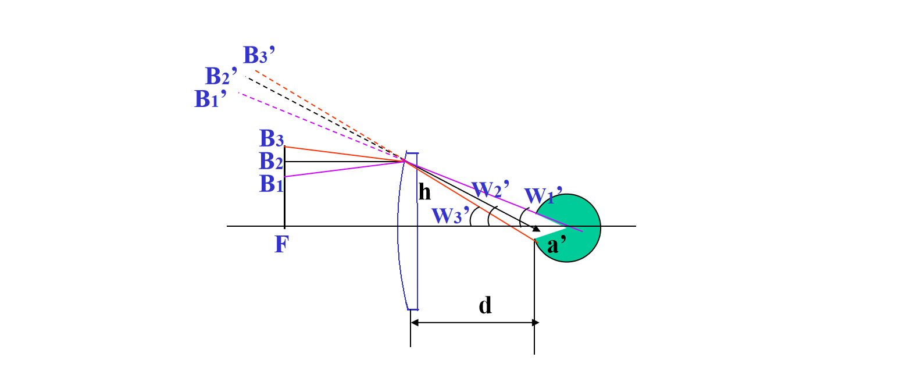
## 三、显微镜

### 1. 放大率

AB在物镜前焦面稍前处，成倒立放大的实像A'B'，A'B'在目镜前焦面稍后处，成放大虚像，位置在无穷远处或明视距离

图

对正常眼，A’B’位于Fe上，显微镜光学筒长为△ = Fo’Fe
$$
M_o=-\frac {x_o'}{f_o'}=-\frac {\bigtriangleup}{f_o'}
$$
$$
M_e=\frac{250}{f_e'}
$$
$$
M=M_oM_e=-\frac{250\bigtriangleup}{f_o'f_e'}
$$
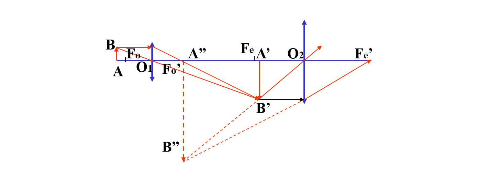
### 2. 光束限制

- 孔径光阑：低倍物镜——为单组物镜框本身
			   高倍物镜——在 Fo’处专设孔阑（远心光路），相对于目镜$X=-\bigtriangleup$

- 出瞳位置：
	$$
	x'=\frac{f_ef_e'}{x}=\frac{f_e'^2}{\bigtriangleup}
	$$
	考虑
	$$
	x_F'=-\frac{f_ef_e'}{\bigtriangleup}=\frac{f_e'^2}{\bigtriangleup}
	$$
	所以出瞳和总焦点位置重合

- 出瞳的大小
	定义数值孔径$A=nsinU$
	$$
	a'=\frac{250}{M}A
	$$

- 视场光阑——在中间实像面上专设视场光阑，无渐晕，视场有清晰的边界
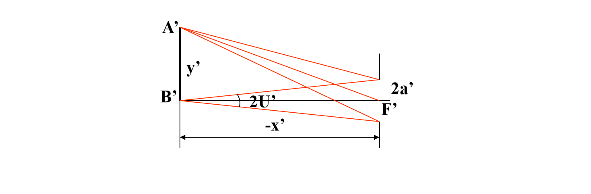
### 3. 景深

- 显微镜本身的景深
	$$
	2dx=\frac{250n\epsilon}{MA}
	$$

- 人眼的调节
	$$
	r-p\propto\frac 1{M^2}
	$$

- 总景深=$2dx+r-p$

	

### 4. 分辨率和有效放大率

- 最小分辨距

$$
\sigma=\frac{0.61\lambda}{A}
$$
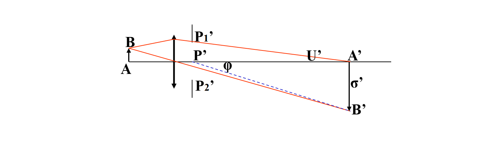
- 有效放大率——能被显微镜分辨的也能被眼睛分辨
	1. 无效放大
	2. 显微镜能分辨而眼睛不能分辨——放大不足

### 5. 照明系统
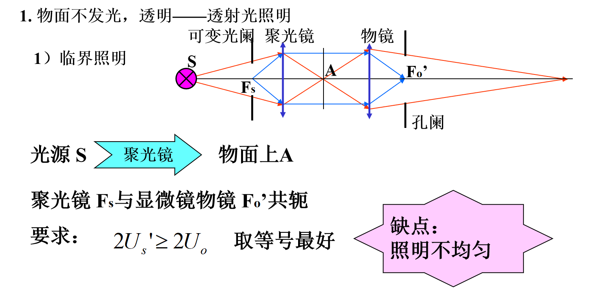
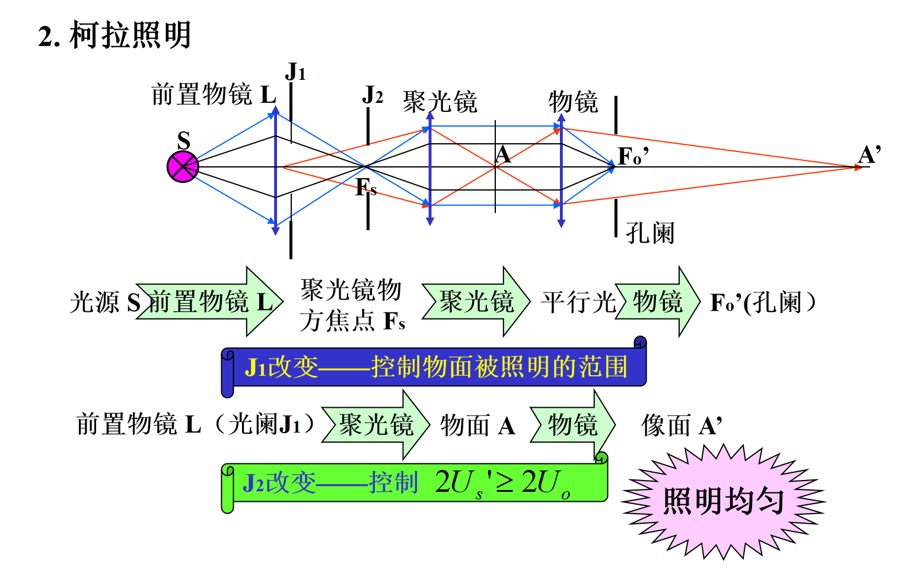
## 四、望远镜系统

### 1. 系统概述

- 开普勒望远系统——筒长较长，有实像面，可加分划板测量，用于观察要加转像系统，结构复杂
	- $D'<D_e$，物镜为孔阑
	- $D'>D_e$，眼瞳为孔阑
	- $D'=D_e$，同时为孔阑
	- 视阑为分划板，目镜为渐晕光阑，拦光时有渐晕
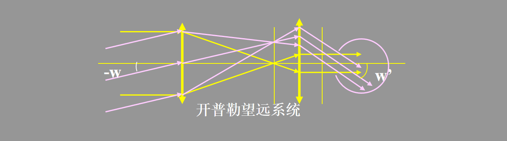
- 伽利略望远系统——筒长较短，无实像面，不能用于测量
	- 眼瞳为孔阑，物镜为渐晕光阑，有渐晕。它在系统像方的像位于物镜与目镜之间某处
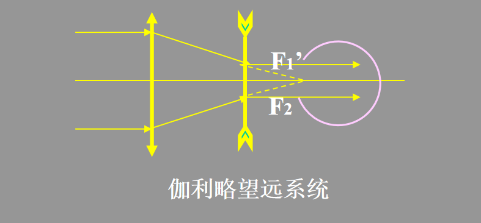
### 2. 视觉放大率

$$
\Gamma=\frac{tgW'}{tgW}=-\frac{f_1'}{f_2'}=\frac{D}{D'}
$$

- $|f_1'|>|f_2'|$，视觉放大
- 筒长$L=f_1'+f_2'$，当$f_2'$一定时，$\Gamma\uparrow\Longrightarrow f_1'\uparrow\Longrightarrow L\uparrow$，与需要矛盾
- 当$W'$一定时，$\Gamma\uparrow\Longrightarrow W\downarrow$，与需要矛盾
- $D'$要与眼瞳匹配，$\Gamma\uparrow\Longrightarrow D\uparrow$，镜筒增大，与需要矛盾

### 3. 分辨率与正常放大率

光学仪器的最小分辨角
$$
\phi=\frac{140''}{D}
$$
正常放大率时
$$
\Gamma\ge\frac D2
$$
当$D'=D/\Gamma=2mm$时，出瞳大小和眼瞳相当

### 4. 瞄准精度

$$
\alpha_t=\frac{\alpha_e}{\Gamma}
$$

瞄准用望远镜$\Gamma$略大些，观察用望远镜$\Gamma$略小些

### 5. 主观亮度

- 点光源
	$$
	\frac{\phi_t}{\phi_e}=k_t\frac{D^2}{D_e^2}
	$$

	- 当$D_e> D'$时，光全部进入眼睛，$\frac{\phi_t}{\phi_e}=k_t\frac{D^2}{D_e^2}$
	- 当$D_e= D'$时，光全部进入眼睛，$D=\Gamma D'$，$\frac{\phi_t}{\phi_e}=k_t\Gamma^2$
	- 当$D_e< D'$时，眼睛变为孔阑，同理，$\frac{\phi_t}{\phi_e}=k_t\Gamma^2$

- 有限大小物
	$$
	\frac{E_t}{E_e}=k(\frac{D'}{D_e})^2
	$$
	当$D'<D_e$时，$\frac{E_t}{E_e}\le k\le 1$

### 6. 光束限制

- 开普勒望远镜：目镜为渐晕光阑，视阑直径为
	$$
	D_F=2f_1'tgW
	$$

- 伽利略望远镜：物镜经目镜所成像不能与眼瞳重合，眼瞳为孔阑，此时物镜为渐晕光阑，50%渐晕公式如下
	$$
	\operatorname{tg} W=\frac{D}{2 \Gamma\left(f_{1}^{\prime}+f_{2}{ }^{\prime}+\Gamma l_{p}{ }^{\prime}\right)}
	$$
	

### 7. 目镜的屈光度调节

$$
\bigtriangleup l=\frac{Nf_2'^2}{1000}
$$

### 8. 转向系统

- 棱镜转向系统
- 透镜转向系统
	- 1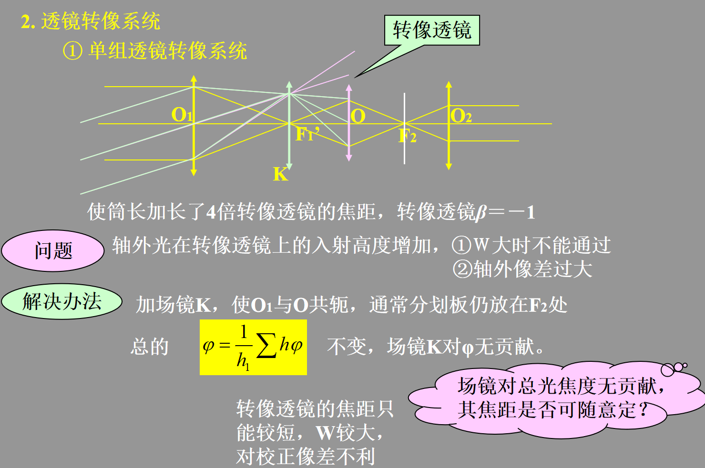
	- 2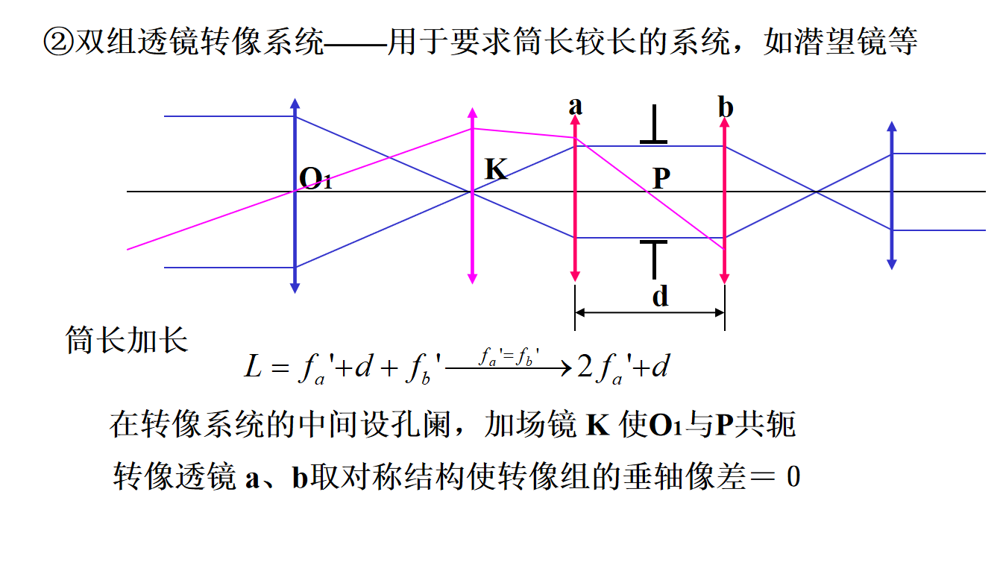