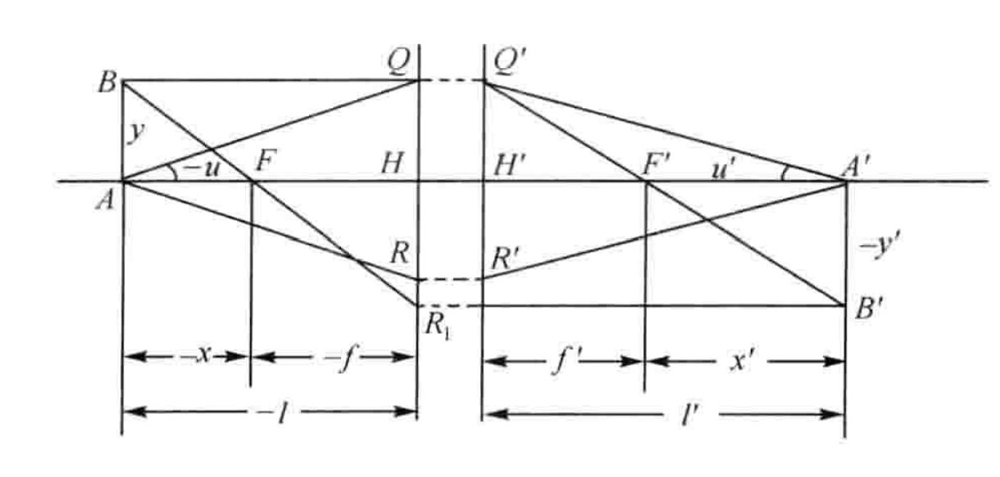
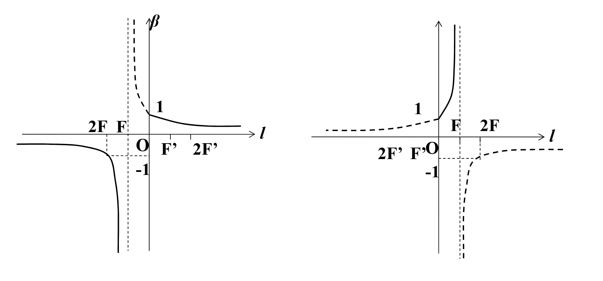
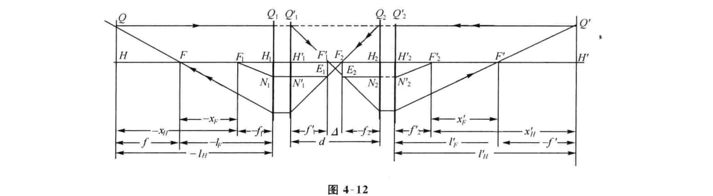
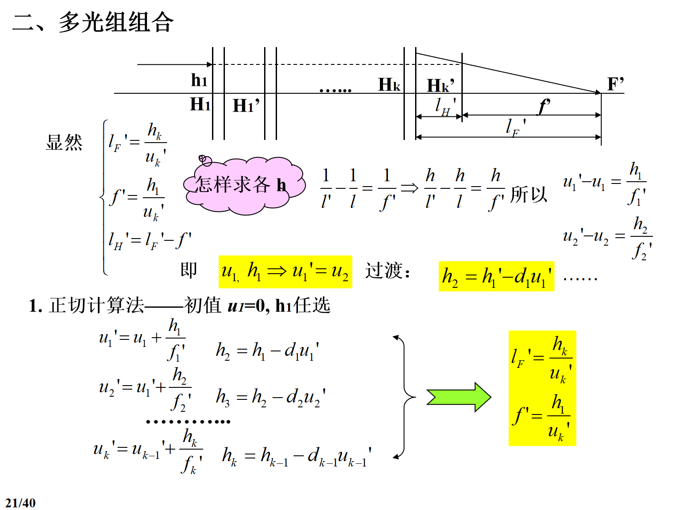

# Chapter 4

## 一、牛顿公式

{: width=800px height=300px }
由三角形相似可导出
$$
xx'=ff'
$$

$$
\beta=\frac{y'}y=-\frac{x'}{f'}=-\frac fx
$$
这是以焦点为原点的物像公式和相应的横向放大率公式，也称**牛顿公式**

---

## 二、高斯公式

代入
$$
x=l-f,x'=l'-f'
$$
可得
$$
\frac{f'}{l'}+\frac fl=1
$$

$$
\beta =\frac{y'}y=-\frac f{f'}\frac{l'}l
$$

由高斯公式可得
$$
\frac{n'f'}{n'l'}+\frac {nf}{nl}=1 \ \ \ and\ \ \ -\frac{f'}{f}=\frac {n'}n
$$
推出
$$
\frac{n'}{l'}-\frac nl=\frac{n'}{f'}=-\frac{n}{f}
$$
当$n'=n$时
$$
\frac{1}{l'}-\frac 1l=\frac{1}{f'}=-\frac{1}{f}
$$

$$
\beta=\frac{l'}l
$$

---

## 三、理想光学系统两焦距的关系和拉氏公式

理想光学系统的拉式公式
$$
nytanU=n'y'tanU'
$$
对近轴区有
$$
nyu=n'y'u'\tag{3-1}
$$
利用相似三角形可得
$$
yftgU=-y'f'tgU
$$
对于近轴区
$$
yfu=-y'f'u'\tag{3-2}
$$
联立3-1和3-2可以推出
$$
\frac{f'}{f}=-\frac {n'}n
$$
若包含k个反射面
$$
\frac{f'}{f}=(-1)^{k+1}\frac {n'}n
$$

---

## 四、光束的汇聚度和系统的光焦度

- 折合物距：$\frac ln$
- 折合像距：$\frac {l'}{n'}$
- 折合焦距：$\frac {f'}{n'}$

前两者取倒数得到汇聚度$V,V'$,正数表示光束会聚，负数表示发散光束

后者取倒数得到光焦度$\Phi$,正数表示起会聚作用，负数表示发散作用
$$
V'-V=\Phi
$$
---

## 五、轴向放大率、角放大率其与横向放大率的关系

### 1. 轴向放大率

$$
xx'=ff'
$$

两边求微分
$$
xdx'+x'dx=0
$$

$$
\alpha=\frac{dx'}{dx}=-\frac{x'}{x}=-\frac {f'}{f}\beta^2
$$

当$n=n'$时，$\alpha=\beta^2$,==立体物像不再相似==

### 2. 角放大率

$$
Y=\frac{tgU'}{tgU}=\frac{ny}{n'y'}=\frac{n}{n'}\frac{1}{\beta}=-\frac{f}{f'}\frac 1\beta
$$

如果$n'=n$，$Y=\frac 1\beta$

## 六、薄透镜在特殊位置的成像

&nbsp;&nbsp;&nbsp;&nbsp;&nbsp;&nbsp;&nbsp;&nbsp;&nbsp;&nbsp;&nbsp;&nbsp;&nbsp;&nbsp;&nbsp;&nbsp;&nbsp;&nbsp;&nbsp;&nbsp;&nbsp;&nbsp;&nbsp;&nbsp;&nbsp;​正透镜成像&nbsp;&nbsp;&nbsp;&nbsp;&nbsp;&nbsp;&nbsp;&nbsp;&nbsp;&nbsp;&nbsp;&nbsp;&nbsp;&nbsp;&nbsp;&nbsp;&nbsp;&nbsp;&nbsp;&nbsp;&nbsp;&nbsp;&nbsp;&nbsp;&nbsp;&nbsp;&nbsp;&nbsp;&nbsp;&nbsp;&nbsp;&nbsp;&nbsp;&nbsp;&nbsp;&nbsp;&nbsp;&nbsp;&nbsp;&nbsp;&nbsp;&nbsp;&nbsp;&nbsp;&nbsp;&nbsp;&nbsp;&nbsp;&nbsp;&nbsp;&nbsp;&nbsp;&nbsp;&nbsp;&nbsp;&nbsp;&nbsp;&nbsp;&nbsp;&nbsp;&nbsp;&nbsp;&nbsp;&nbsp;&nbsp;&nbsp;&nbsp;&nbsp;&nbsp;&nbsp;&nbsp;负透镜成像

## 七、理想光学系统的图解求像

1. 平行于光轴的光线经理想光学系统后必通过像方焦点；
2. 过物方焦点的光线经理想光学系统后必为平行于光轴的光线
3. 过节点的光线方向不变
4. 任意方向的一束平行光经理想光学系统后必交于像方焦平面上一点
5. 过物方焦平面上一点的光线经理想光学系统后必为一束平行光。
6. 主面交点光线高度相同

## 八、光学系统的组合

两种计算方法：

   - 正切计算法

   - 截距计算法

四组公式：
$$
X_F'=-\frac{f_2f_2'}{\bigtriangleup}
$$
$$
X_F=\frac{f_1f_1'}{\bigtriangleup}
$$
$$
f'=-\frac{f_1'f_2'}{\bigtriangleup}
$$
$$
f=\frac{f_1f_2}{\bigtriangleup}
$$
$$
\bigtriangleup=d-f_1'+f2
$$

注：这些公式与光组是否在空气中无关

一般光组在空气中，可得$f'=-f$
$$
f'=\frac{f_1'f_2'}{f_1'+f_2'-d}
$$

$$
\phi=\frac{1}{f'}=\frac{f_1'+f_2'-d}{f_1'f_2'}=\phi_1+\phi_2-d\phi_1\phi_2
$$

复杂光学系统各光组光焦度对总光焦度的贡献
$$
\phi=h_1\sum_{1}^kh_i\phi_i
$$

## 九、望远镜系统

定义：以平行光入射，再以平行光出射的系统

### 1. 放大率
如下：
$$
\beta=\frac{f_2}{f_1'}
$$
$$
\alpha=\frac{f_2f_2'}{f_1f_1'}
$$
$$
\gamma=\frac{f_1}{f_2'}
$$

### 2. 视觉放大率

$$
\Gamma=\frac{tgU'}{tgU}=\gamma=-\frac{f_1'}{f_2'}
$$

### 3. 讨论

- 要求主观放大，即$\Gamma = \gamma > 1$，即$|f_1'| > |f_2'|$

- 一般要求$f_1' > 0$，$f_2'$可正可负

	- $f_2' > 0$，成倒像，观察不便，但便于测量，必要时加倒像系统
	- $f_2' < 0$，成正像，用于观察，但无实像面，不能测量

- 当$|f_1'| > |f_2'|$时
	$$
	|\beta| < 1 \tag{物经望远镜成缩小像}
	$$
	$$
	|\alpha| \ll 1 \tag{但距离拉近很多}
	$$
	$$
	|\Gamma| = |\gamma| > 1 \tag{对眼睛的张角变大}
	$$

- 系统一定，则$\beta, \alpha, \gamma$为定值，与物距$l$无关

## 十、透镜

### 1. 薄透镜

薄透镜：$H, H'$重合，$J, J'$重合，$f = -f'$

对薄透镜的两个球面运用高斯公式可得
$$
\frac{1}{l'} - \frac{1}{l} = \frac{1}{f'}
$$
$$
\phi = \frac{1}{f'} = (n - 1) \left( \frac{1}{r_1} - \frac{1}{r_2} \right)
$$
放大率
$$
\beta = \beta_1 \beta_2 = \frac{l'}{l} = \frac{u}{u'}
$$
$$
\alpha = \beta^2
$$
$$
\gamma = \frac{1}{\beta}
$$
共轭距
$$
L = |l' - l| = \left| \left( 2 - \beta - \frac{1}{\beta} \right) f' \right|
$$

### 2. 厚透镜

1. **双凸透镜**
	- 当$d < \left|\frac{n(r_2 - r_1)}{n - 1}\right|$时，是正透镜，主面在内
	- 当$d = \left|\frac{n(r_2 - r_1)}{n - 1}\right|$时，是望远镜，无焦系统
	- 当$d > \left|\frac{n(r_2 - r_1)}{n - 1}\right|$时，是负透镜，主面在外
	- 当$d = r_1 - r_2$时，主面重合于球心
2. **双凹透镜**
	- 不管$d$怎么变，$f' < 0$恒成立，主面也总在内部
3. **平凸透镜**
	- $f' > 0$，且与$d$无关，$l_H = 0, l_{H'} = -\frac{d}{n}$
4. **平凹透镜**
	- $f' < 0$，且与$d$无关，$l_H = 0, l_{H'} = -\frac{d}{n}$
5. **弯月型凸透镜**
	- $f' > 0$，$H$在$H'$之前，且在透镜之外；$H'$也可能位于透镜之外
6. **弯月型凹透镜**
	- 当$d < \left|\frac{n(r_2 - r_1)}{n - 1}\right|$时，是负透镜
	- 当$d = \left|\frac{n(r_2 - r_1)}{n - 1}\right|$时，是望远镜，无焦系统
	- 当$d > \left|\frac{n(r_2 - r_1)}{n - 1}\right|$时，是正透镜
	- 当$d = r_1 - r_2$时，主面重合于球心

 
