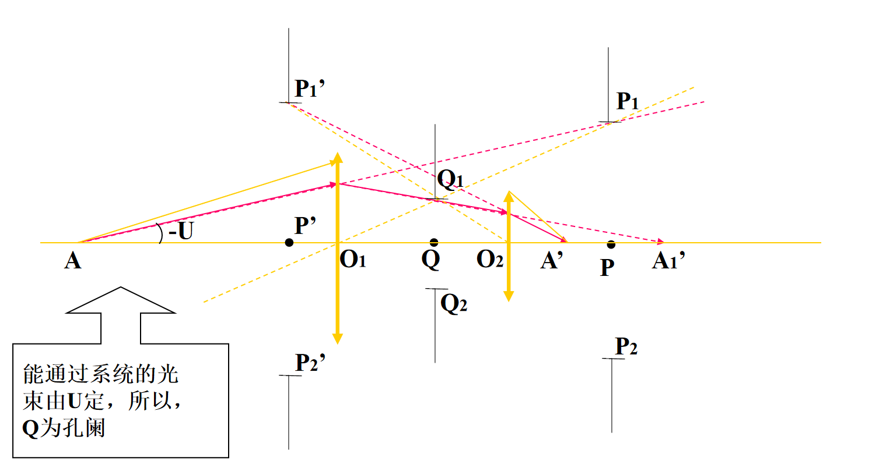
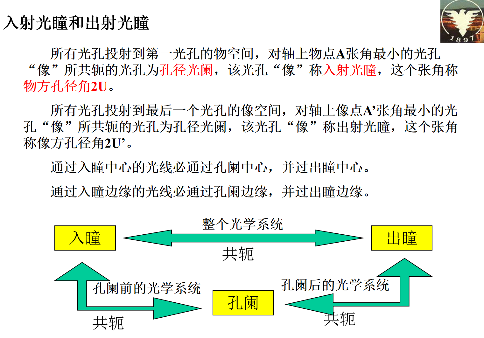
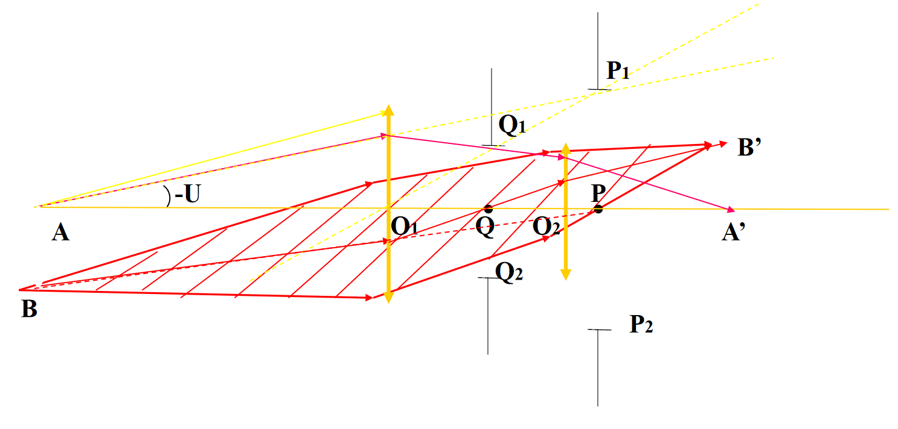

# Chapter 5

## 一、视场角的计算

$$
y'=-f'tgW
$$

视场角即为$2W$，假设光电检测器为$24\times 36$

$$
y'=\frac12(\sqrt{24^2+36^2})
$$
## 二、光阑的概念

### 1. 孔径光阑——限制轴上点成像光束中边缘光线的最大倾角（孔径角）

### 2. 视场光阑——限制物空间中多大范围能被成像（视场） 注：一般在实像平面或中间实像面上

- 成像物镜：成像器件$2y'$决定视场角$2W$
- 望远镜：中间实像面上的分划板大小决定视场角

### 3. 渐晕光阑——限制轴外成像光束的宽度

一个系统可以有1~2个渐晕光阑

渐晕系数：

- 面渐晕系数=轴外点光束在入瞳上的截面积／入瞳面积
- 线渐晕系数=轴外点光束在入瞳上的高度／入瞳直径

## 三、景深

相对孔径大小=$2a/f'$
光圈数=1/相对孔径大小

远景深：
$$
\bigtriangleup_1=\frac{p^2\epsilon}{2af'-p\epsilon}
$$
近景深：
$$
\bigtriangleup_2=\frac{p^2\epsilon}{2af'+p\epsilon}
$$
由公式可得：

- 相对孔径大，光圈数小，长焦系统，景深小
- 相对孔径小，光圈数大，短焦系统，景深大，且$\bigtriangleup_1>\bigtriangleup_2$

并非$p$越大，景深越大，特例：

- 当$p\rightarrow \infty$时的景深不如当$p_1\rightarrow \infty$时$p$在$p_1$前的景深来的大
## 四、远心光学系统

远心光学系统——孔阑位于焦平面上

- 物方远心光路——孔阑与F’重合，入瞳位于物方无穷远，物方主光线平行于光轴
- 像方远心光路——孔阑与F重合，入瞳位于像方无穷远，像方主光线平行于光轴

