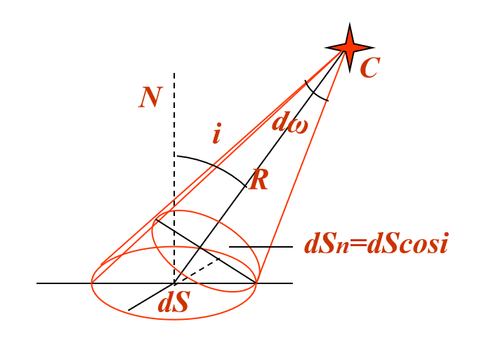
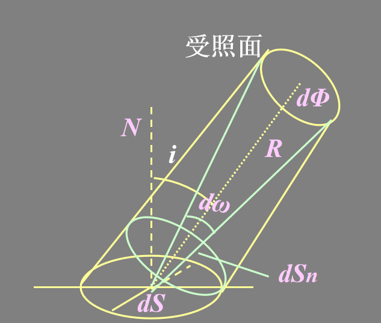
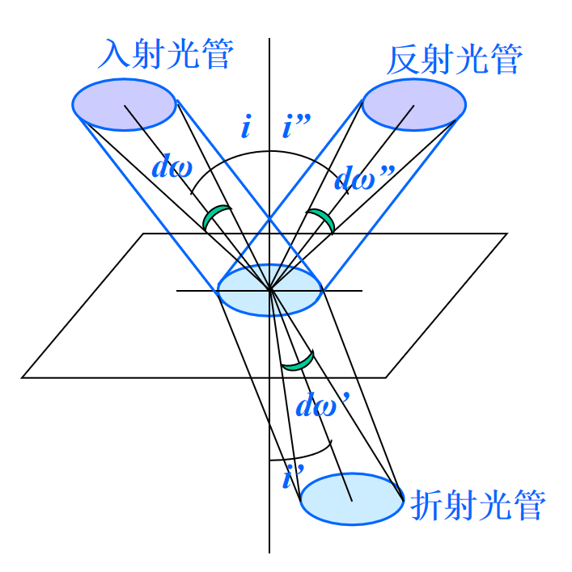
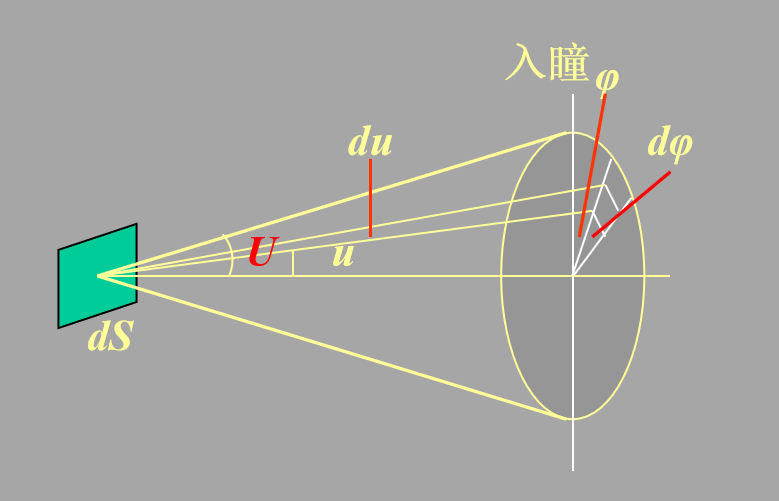
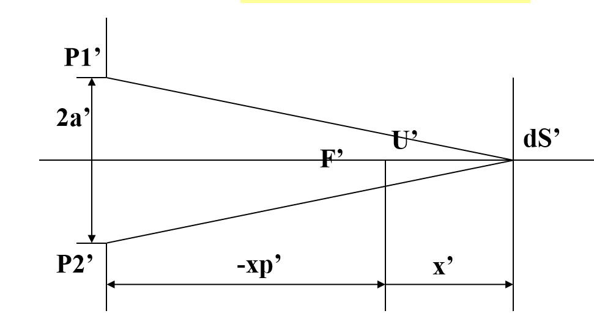
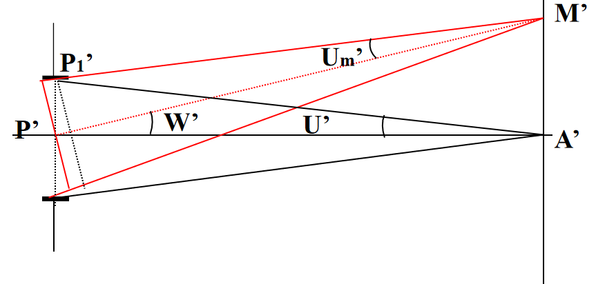

# Chapter 6

## 一、辐射能通量

单位时间内通过某一面积的全部辐射能W
$$
dW=P_\lambda d\lambda
$$

$$
W=\int_{\lambda_1}^{\lambda_2}dW=\int_{\lambda_1}^{\lambda_2}P_\lambda d\lambda
$$

## 二、光谱光视效率

定义
$$
K_\lambda=\frac{\Phi_\lambda}{P_\lambda}
$$
光谱光视效率
$$
V_\lambda=\frac{K_\lambda}{K_{555}}
$$

## 三、光通量与发光效率

定义：辐射能通量的光量度，即若干辐射能相当于多少光，单位$lm$
$$
\Phi=\int_{\lambda_1}^{\lambda_2}V_\lambda P_\lambda d\lambda\ \ (W)=K_{555}\int_{\lambda_1}^{\lambda_2}V_\lambda P_\lambda d\lambda\ \ (lm)
$$

$$
\eta=\frac \Phi W\ \ (lm/W)
$$

## 四、发光强度

定义：光源在元立体角$dw$内发出的光通量为$d\Phi$，单位$cd$
$$
I=\frac{d\Phi}{d\omega}
$$

$$
d\omega=\frac{dS}{R^2}
$$

## 五、光照度

定义：单位面积上的光通量,单位$lx$
$$
E=\frac{d\Phi}{dS}
$$

当其是点光源时

$$
E=\frac{d\Phi}{dS}=\frac{Id\omega}{dS}=\frac{IdS_n/R^2}{dS}=\frac{I}{R^2}cosi
$$

## 六、光出射度

定义：发光表面单位面积上的光通量,单位$lx$
$$
M=\frac{d\Phi}{dS}
$$
透射面或反射面作为二次光源发出光通量
$$
M=\rho E
$$
对所有波长$\rho\rightarrow1$，称为白体
对所有波长$\rho\rightarrow0$，称为黑体

## 七、光亮度

定义：面积$1m^2$的发光表面在法线方向的发光强度为$1cd$时的亮度为$1nt$
$$
d\Phi=L_id\omega\cdot dS \cdot cosi
$$

$$
L_i=\frac{d\Phi}{d\omega\cdot dS \cdot cosi}=\frac{I}{ dS_n}
$$

某些光源
$$
I_i=I_N cosi
$$
即$L$不随方向变，此时$I$随方向变，这种光源称为余弦辐射体

## 八、光传播过程中光学量的变化

### 1.光亮度在同一介质中传播

$$
d\Phi_1=L_1d\omega_1\cdot dS_1 \cdot cosi_1
$$

$$
d\Phi_2=L_2d\omega_2\cdot dS_2 \cdot cosi_2
$$

忽略散射和吸收
$$
d\Phi_1=d\Phi_2
$$

$$
L_1=L_2
$$

### 2. 光束经界面反射和折射后的亮度

三者均有如下公式
$$
d\Phi=Ld\omega\cdot dS \cdot cosi
$$

$$
d\omega=sini\ di\ d\phi
$$

反射时$i''=-i$，所以$d\omega''=d\omega$
$$
\frac{d\Phi''}{d\Phi}=\frac{L''}L=\rho
$$
这里$\rho$是反射率，当入射角不大时
$$
\rho=(\frac{n'-n}{n'+n})^2
$$
折射时有微分折射定律
$$
n^{\prime} \sin i^{\prime}=n \sin i
$$

$$
n^{\prime} \cos i^{\prime} d i^{\prime}=n \cos i d i
$$

可得
$$
\frac{d \omega^{\prime}}{d \omega}=\frac{\sin i^{\prime} d i^{\prime}}{\sin i d i}=\frac{n^{2} \cos i}{n^{\prime 2} \cos i^{\prime}}
$$
又因为
$$
d \Phi^{\prime}=d \Phi-d \Phi^{\prime \prime}=d \Phi(1-\rho)
$$
所以

$$
L^{\prime}=(1-\rho) L\left(\frac{n^{\prime}}{n}\right)^{2}
$$

## 九、光学系统的光能损失

$\tau$为透过率，$1-\tau$为吸收率
$$
L=L_0\tau^d
$$

## 十、成像光学系统像面的照度

### 1. 通过光学系统的通光量

从入瞳看
$$
\Phi^{\prime}=K \pi L d S \sin ^{2} U
$$
从出瞳看

$$
\Phi^{\prime}=\pi L^{\prime} d S^{\prime} \sin ^{2} U^{\prime}=\pi k L\left(\frac{n_{k}{ }^{\prime}}{n_{1}}\right)^{2} d S^{\prime} \sin ^{2} U^{\prime}
$$

光照度

$$
E'=\frac1{\beta^2}K \pi L\sin ^{2} U
$$

### 2. 轴上像点的光照度

$$
E^{\prime}=\frac{\pi K L}{4}\left(\frac{2 a}{f^{\prime}}\right)^{2} \cdot \frac{\beta_{p}^{2}}{\left(\beta_{p}-\beta\right)^{2}}
$$

### 3. 轴外像点的光照度

$$
E_{M'}=E'cos^4W'
$$

