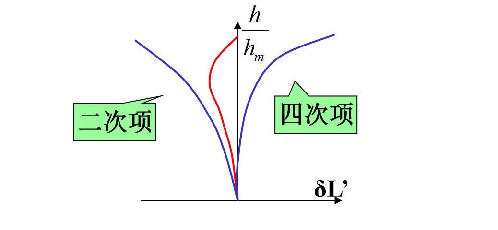
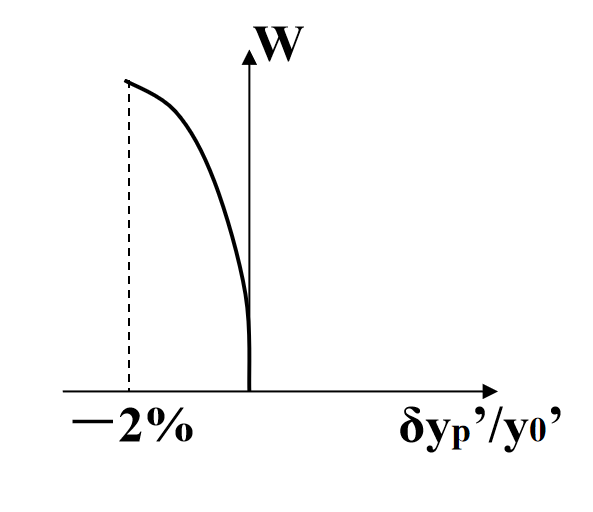
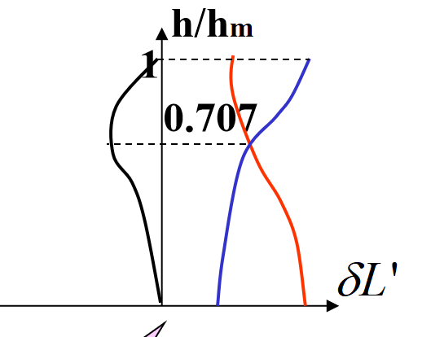
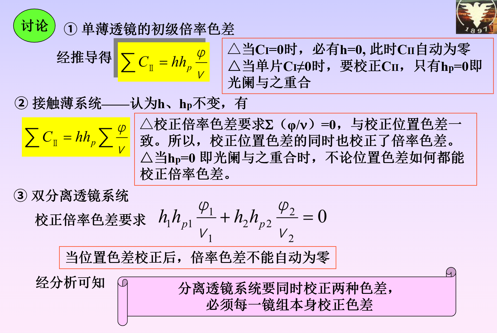

# Chapter 7

## 1. 像差分类

| 序号 | 像差名称 | 符号             | 分类1 | 分类2 | 分类3  | 分类4 | 现象           | 曲线       |
| ---- | -------- | ---------------- | ----- | ----- | ------ | ----- | -------------- | ---------- |
| 1    | 球差     | $\delta l'$      | 轴上  | 单色  | 宽光束 | 轴向  | 圆弥散斑       | 球差曲线   |
| 2    | 彗差     | $K_t'$           | 轴外  | 单色  | 宽光束 | 垂轴  | 彗星尾巴       | /          |
| 3    | 像散     | $\Delta x$       | 轴外  | 单色  | 细光束 | 轴向  | 子午/弧矢焦面  | 像散、场曲 |
| 4    | 场曲     | $x_t', x_s'$     | 轴外  | 单色  | 细光束 | 轴向  |                | 畸变       |
| 5    | 畸变     | $\delta y_p'$    | 轴外  | 单色  | 细光束 | 垂轴  | 枕型、桶型     |            |
| 6    | 位置色差 | $\delta l_{ch}'$ | 轴上  | 色差  | 宽光束 | 轴向  | 彩色圆弥散斑   | 色球差     |
| 7    | 倍率色差 | $\delta y_{ch}'$ | 轴外  | 色差  | 细光束 | 垂轴  | 彩色光谱弥散斑 | /          |

* **像差**
    * **单色像差**
        * **轴上点像差**
            * 球差
        * **轴外点像差**
            * 彗差
            * 像散
            * 场曲
            * 畸变
    * **色差**
        * 位置色差
        * 倍率色差

## 2. 像差曲线

- 球差曲线

- 像散和场曲曲线

- 畸变的度量和曲线

- 色差曲线

## 3. 单个折射球面球差和球差分布

球差公式：

$$
\delta L' = \frac{nu \sin U}{n'u' \sin U'} \delta L - \frac{1}{2n'u' \sin U'} S\_
$$

假设物方无球差

$$
\delta L' =  - \frac{1}{2n'u' \sin U'} S\_
$$

$$
S\_=\frac{niL \sin U (\sin I' - \sin U)(\sin I - \sin I')}{\cos \frac{1}{2}(I - U) \cos \frac{1}{2}(I' + U) \cos \frac{1}{2}(I + I')}
$$

令上式等于0，得到三个无球差点
$$
L=0
$$

$$
L=r
$$

$$
L=\frac{n'+n}{n}r,L'=\frac{n'+n}{n'}r
$$

## 4. 初级像差

|   像差   |                             公式                             | 正比于 |     塞德和数     |  正比于  |
| :------: | :----------------------------------------------------------: | :----: | :--------------: | :------: |
|   球差   |       $\delta L_0' = -\frac{1}{2n_k'u_k'^2} \sum S_I$        | $u^2$  |      $S_I$       |  $u^4$   |
|   彗差   | $K_{s0} = -\frac{1}{2n'u'} \sum S_{II},K_{t0} = -\frac{3}{2n'u'} \sum S_{II}$ | $u^2W$ |     $S_{II}$     |  $u^3W$  |
|   场曲   | $x_t' = -\frac{1}{2n'u'^2}(3\sum S_{III} + \sum S_{IV}) , x_s' = -\frac{1}{2n'u'^2}(\sum S_{III} + \sum S_{IV})$ | $W^2$  | $S_{III}+S_{IV}$ | $u^2W^2$ |
|   像散   |  $\Delta x = x_t' - x_s' = -\frac{1}{n'u'^2} \sum S_{III}$   | $W^2$  |    $S_{III}$     | $u^2W^2$ |
|   畸变   |          $\delta y_p' = -\frac{1}{2n'u'} \sum S_V$           | $W^3$  |      $S_V$       |  $uW^3$  |
| 位置色差 | $\delta l_{ch}' =l_F'-l_C'= -\frac{1}{n_k' u_k'^2} \sum C_I$ | $u^0$  |      $C_I$       |  $u^2$   |
| 倍率色差 |        $\delta y_{ch}' = -\frac{1}{n'u'} \sum C_{II}$        |  $W$   |     $C_{II}$     |   $uW$   |

​	$\sum S_I 和\sum S_{IV}$仅与第一近轴光线有关量有关，而$\sum S_{II},\sum S_{III}和 \sum S_V$除与第一近轴光线有关量值有关外，还与第二近轴光线有关量有关。各折射面的$i_p$值随光阑位置而异，所以$\sum S_{II},\sum S_{III}和 \sum S_V$将随光阑位置的改变而改变
​	初级位置色差仅与第一近轴光线有关量有关，初级倍率色差和第一第二都有关

## 5. 初级像差的矫正方法

1. 球差：正负透镜组合（会聚作用产生负球差，发散作用产生正球差）；弯曲透镜可以保持焦距，矫正球差（单个薄透镜不可能矫正球差）；通过初级球差和高级球差相互补偿而抵消，矫正边缘带球差
1. 彗差：光阑和透镜的相对位置；$i_p=0$
1. 场曲：正负光焦度分离矫正匹兹凡面弯曲
1. 像散：光阑和薄透镜/球心重合；
1. 畸变：光阑和薄透镜/球心重合
1. 位置色差：对双胶合及微小间隙的双分离组
   
	$$
	\left\{
	\begin{array}{l}
	\frac{\varphi_1}{V_1} + \frac{\varphi_2}{V_2} = 0 \\
	\varphi_1 + \varphi_2 = \varphi
	\end{array}
	\right.
	$$

	$\varphi_1$与$\varphi_2$2必须异号，必须用不同牌号玻璃，且其阿贝常数之差应尽可能大。

2. 倍率色差：光阑与薄透镜重合，不同的系统要求不同，见下

## 6. 平行平板的像差

1. 球差：

$$
\delta L_{p0}' = \frac{n^2-1}{2n^3}du_1^2 > 0
$$

---

**结论**

① 平行平板恒产生正球差 ($n>1$)，只能以产生负球差的系统补偿之。当且仅当 $u_1=0$ 时，$\delta L_p'=0$

② $\delta L_p' \propto d$ 平板厚则球差大。

③ $\delta L_{p0}' \propto u_1^2$ 平板虽薄但孔径大，球差也大。

2. 色差：

	① 平行平板的初级位置色差
	$$
	 \sum C_I = -\frac{dn}{n^2}du_1^2 
	$$
	
	$$
	\delta l_{ch}' = \frac{dn}{n^2} \cdot d > 0
	$$

	---
	**结论:** 平行平板恒产生正色差，当且仅当 $u_1=0$ 即光束平行入射时，才不产生位置色差