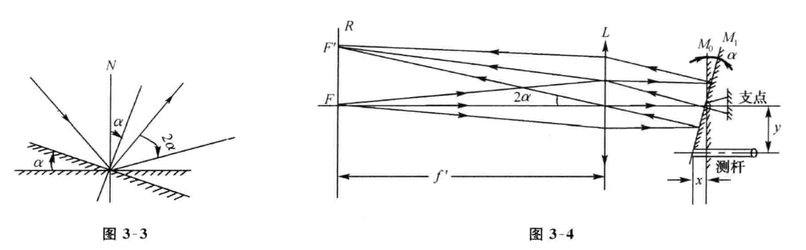
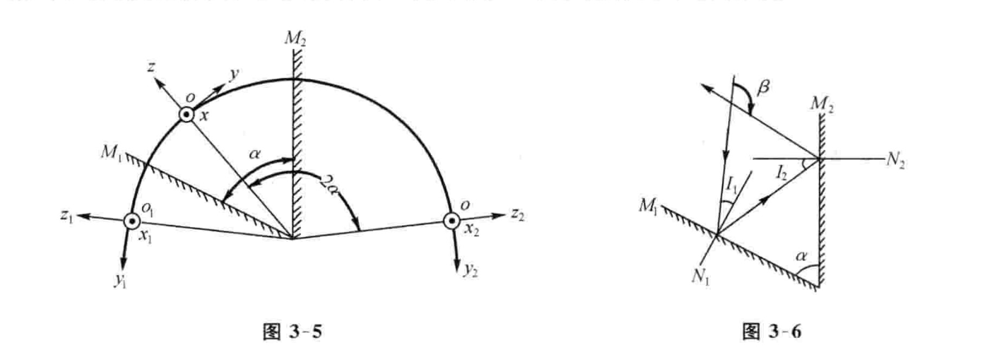
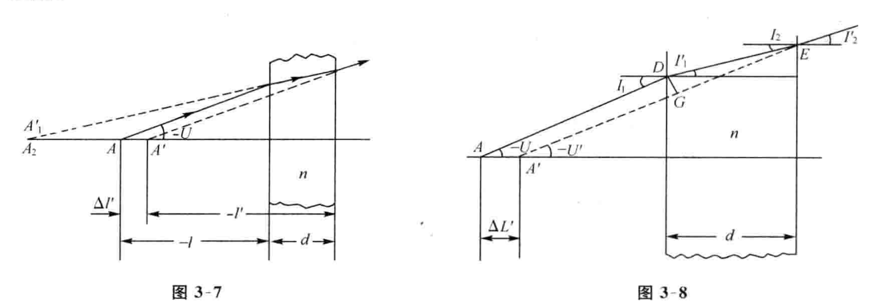
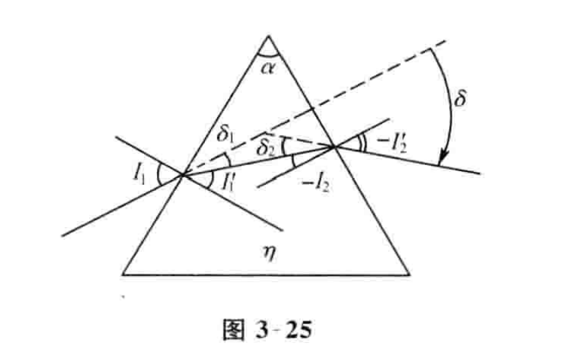

# Chapter 3

## 一、平面镜和双平面镜

### 1. 平面镜
在式（2-2）中，令$n=-n',r=\infty$，可得
$$
l'=-l,\beta=1
$$
在平面镜系统中，保持入射光线不变，将平面转过$\alpha$角，反射光线将转过$2\alpha$角

### 2. 双平面镜  

夹角为$\alpha$的双平面镜系统，对他们之间的物体二次成像是由物体绕Q轴转动$2\alpha$角而得

物体经双面镜相继反射一次，二次反射光线相当于入射光线按图中所示方向转斗$\beta$角而得
$$
\beta=2(I_1+I_2)=2\alpha
$$

## 二、平行平板

从图可见，近轴光线经平行平板折射后像相对于物得距离$\bigtriangleup l'$
$$
\bigtriangleup l'=d(1-\frac1n)
$$
从图可见，非近轴光线经平行平板折射
$$
\bigtriangleup L'=d(1-\frac{tanI'}{tanI})
$$

$$
\bigtriangleup t'=d(1-\frac1n)i1 \tag{近轴区}
$$

## 三、反射棱镜

### 1. 结构常数K

结构常数K表示棱镜的通光直径D和棱镜中的光轴长度d之间的关系，即
$$
K=\frac dD
$$

### 2. 坐标轴变化规律
坐标轴经棱镜系统时的变化规律：

- 设物方为右手坐标系统
- 沿光轴方向的坐标轴oz经棱镜系统后仍与光轴进行方向相同
- 垂直于主截面的坐标轴ox的方向经系统后是否倒转由系统中的屋脊个数决定
	- 奇数个屋脊时要倒转
	- 偶数个屋脊时不变
- 在主截面的坐标轴oy经系统后的方向由系统的总反射次数决定
	- 奇次反射像空间的坐标系与物方对称，成为左手系
	- 否则为右手系

### 3. 角锥棱镜

以任意方向入射于底面的光线，经三个面反射后将以相反方向从底面射出

## 四、折射棱镜

最小偏角$\delta$与$\alpha、n$之间的关系为
$$
sin(\frac{\alpha+\delta_{min}}{2}=nsin\frac\alpha 2)
$$

{: width=400px height=250px }

如果折射角$\alpha$很小，分两种情况讨论

1. 光线的入射角有一定大小，如图
	$$
	\delta=\alpha(\frac{ncosI_1'}{cosI_1}-1)
	$$

2. 光线垂直入射或入射角很小时，上式的余弦值为1，得
	$$
	\delta=(n-1)\alpha
	$$

折射角很小得棱镜称为光楔，两光楔相对转动产生的偏角称为$\phi$
$$
\delta=2(n-1)\alpha cos\frac\phi2
$$

